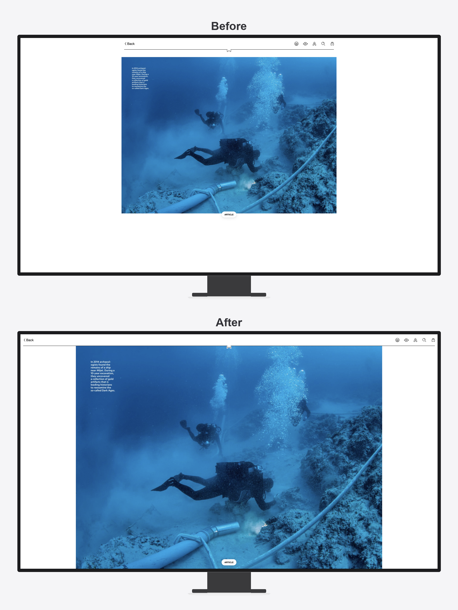

# Libby Full Width Reader

A Chrome extension that makes Libby's magazine reader fill your entire screen.

Libby hard-caps magazine layout at ~1320px wide — regardless of your monitor. On a high-res display, most of your screen is white padding. This extension removes those constraints, and the app re-renders content natively at the larger size. No blurry upscaling.

**2× more content on screen** on a high-res display. Best for large and ultrawide monitors.



## Install

**[Install from the Chrome Web Store →](https://chromewebstore.google.com/detail/libby-full-width-reader/bojpmhpdihcommlljjcegaclimfkgcjk)** (recommended)

Or load it unpacked from source:

1. Download or clone this repo
2. Open `chrome://extensions/` in Chrome
3. Enable **Developer Mode** (top right toggle)
4. Click **Load unpacked** and select this folder
5. Open a magazine on libbyapp.com — it should now fill your screen

## How It Works

Two CSS rules. That's it.

```css
.book-pillar {
  max-width: none !important;
}

.book-bounds {
  max-height: calc(100vh - 72px) !important;
}
```

Libby's layout engine reads container dimensions at startup. Because CSS loads before the app initializes, it computes the layout using our overridden values natively — the content is actually rendered at the larger size, not stretched.

## Notes

- Built for magazine reading (pre-paginated spreads). Behavior with ebooks may vary.
- The `72px` height offset accounts for Libby's header bar. If the bottom of your magazine is slightly clipped, try adjusting this value.
- Tested on Chrome. Should work on any Chromium-based browser (Edge, Brave, Arc, etc.).
